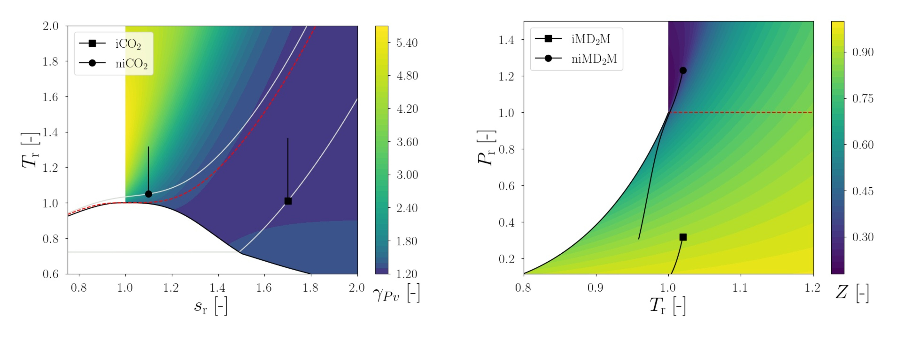
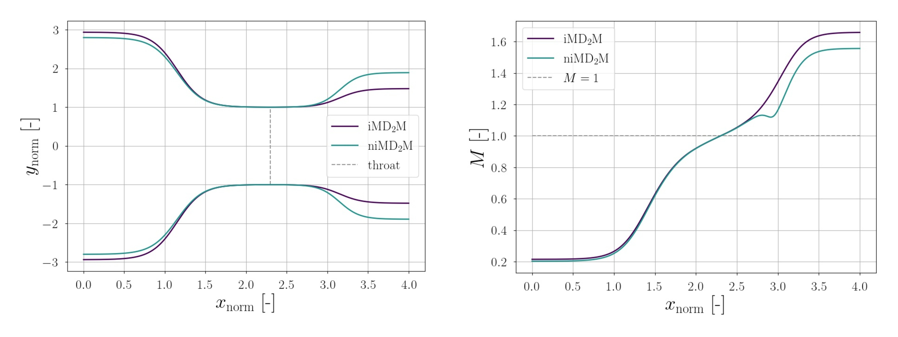
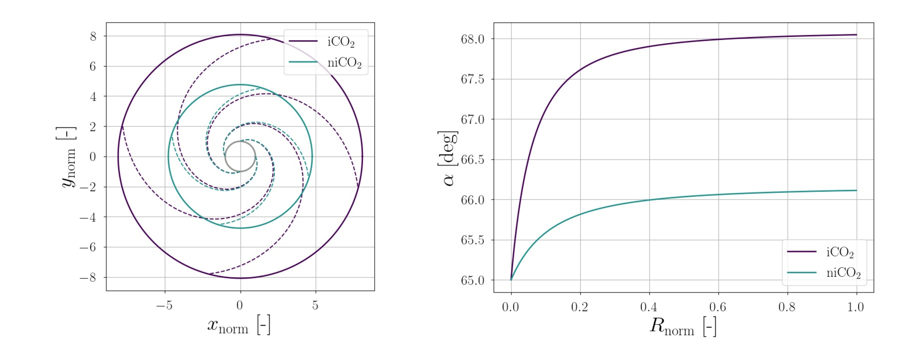

# NiceProp 

NiceProp is an object-oriented Python program for teaching and research in the field of Non-Ideal Compressible Fluid Dynamics (NICFD).

  


---

### Features
NiceProp is used to investigate and characterize the flow behavior of arbitrary working fluids by means of cubic (Peng-Robinson, Soave-Redlich-Kwong) and multi-parameter (Span-Wagner)
equations of state and to compute non-ideal flow properties such as the compressibility factor, the fundamental derivative of gas-dynamics, the generalized
isentropic exponents, etc.
Non-ideal flow properties are visualized in the form of contour plots in the reduced T-s and P-T thermodynamic diagrams.
NiceProp is also employed to analyze the variation of flow properties over prescribed isentropic transformations in stationary flow devices, 
i.e. converging-diverging nozzle, conical diffuser, radial diffuser. The analysis of simple flow processes and the comparison of
the flow behavior observed in different thermodynamic conditions is paradigmatic to understand the implications of NICFD and to
efficiently design more complex flow devices, e.g. supersonic stators for ORC turbines.

---

### Developers
* **A. Giuffre'**, PhD Researcher, Propulsion & Power, TU Delft
* **M. Pini**, Assistant Professor, Propulsion & Power, TU Delft

[](mailto:a.giuffre@tudelft.nl;m.pini@tudelft.nl?subject=NiceProp:Query)

---

### Pre-requisites
##### [Python 3.x](https://python.org)
##### [LaTeX](http://tug.org/texlive/) (for plot rendering)
##### [NumPy](https://numpy.org)
```
sudo pip install numpy
```
##### [SciPy](https://scipy.org)
```
sudo pip install scipy
```
##### [PyFiglet](https://github.com/pwaller/pyfiglet)
```
sudo pip install pyfiglet
```
##### [tqdm](https://pypi.org/project/tqdm/)
```
sudo pip install tqdm
```
##### [MatPlotLib](https://matplotlib.org)
```
sudo pip install matplotlib
```
##### [CoolProp](http://www.coolprop.org)

```
sudo pip install CoolProp
```

##### [REFPROP](https://www.nist.gov/srd/refprop) (optional)

REFPROP library must be manually compiled if working with Linux or Mac OS. Please refer to https://github.com/usnistgov/REFPROP-cmake for further information.

---

### How to get started
1. Run main.py and specify the name of your configuration file
  
2. Press the Run button

3. Visualize results in the output folder named after the selected working fluid

---

### Expansion in converging-diverging nozzle


NiceProp can be used to analyze the evolution of isentropic flow quantities along a converging-diverging nozzle. The nozzle shape can be either provided by the user or designed by the tool itselft, by editing the last entry of isentropic transformation in the configuration file.

- If the nozzle geometry is not provided as input, NiceProp tries to perform a converging-diverging nozzle design with the provided input and the default settings and plots the result to screen. Once closed the figure, NiceProp prints to screen: 'Is the nozzle shape ok? (y/n)'. If the user accepts the proposed nozzle geometry, the execution of the program proceeds, otherwise the user is asked to specify new values for the variables k_in, k_out which characterize the non-dimensional nozzle shape (see method NozzleExpansion in module isentropic_process.py). This process is iterated until a satisfactory nozzle shape is obtained. Be careful: some combination of values may lead to unfeasible nozzle shapes.

- In order to specify the nozzle geometry as input, the user must provide a file named nozzleCoordinates.txt in the input directory. The file must be formatted as the one shipped with the software. Note that multiple nozzle geometries could be specified in the same coordinate file, by separating them with the header NEW NOZZLE GEOMETRY.

---

### Compression in radial and conical diffuser


NiceProp can be used to analyze the evolution of isentropic flow quantities along a conical or a radial diffuser. The vaneless diffuser is assumed to be located after the impeller of a compressor stage. Once the total-to-static compression ratio of the transformation is specified, together with the target pressure recovery of the diffuser, the outlet flow velocity and the mass flow rate, the inlet and outlet passage areas are computed.
Then, the conical diffuser geometry is determined by setting the value of the semi-aperture angle, while the radial diffuser geometry is computed by specifying the values of the inlet flow angle and the non-dimensional passage height, see method DiffuserCompression in module isentropic_process.py.

---

### Notes
1. The success of a NiceProp run is subordinated to the convergence of each EoS call inside the code. In turn, be careful to select the limits of Pr, Tr, sr axes and the reduced inlet conditions within the admissible range of the selected EoS. Convergence is not guaranteed in the extreme proximity of the critical point and within the two-phase region.

2. In the configuration file, the number of entries related to inlet state definition, labels of the thermodynamic processes, mass flow rate, and flow velocity must be coincident. 

3. The number of samples (first entry of contour plot settings in the configuration file) is the parameter mainly affecting the computational cost. The recommended settings are: 100 samples to obtain results almost in real time, 1000 samples to obtain smooth contour plots. 

---

### Citation
Giuffre', A., and Pini, M., 2021. "NiceProp: An Interactive Python-based Educational Tool for Non-Ideal Compressible Fluid Dynamics". SoftwareX